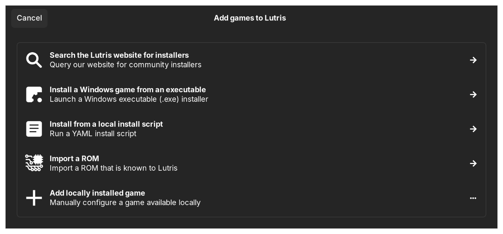
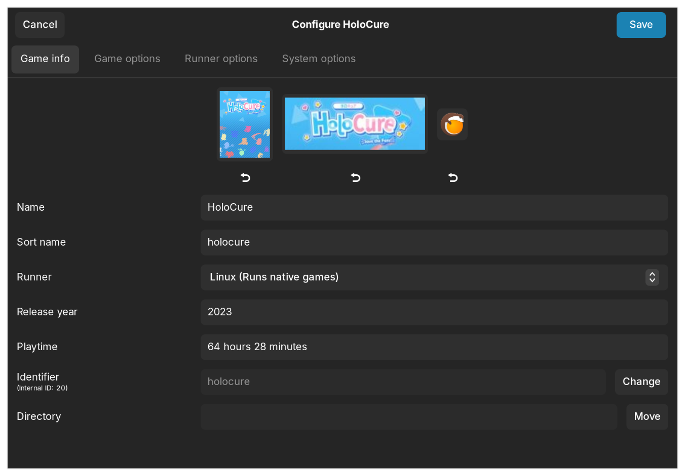
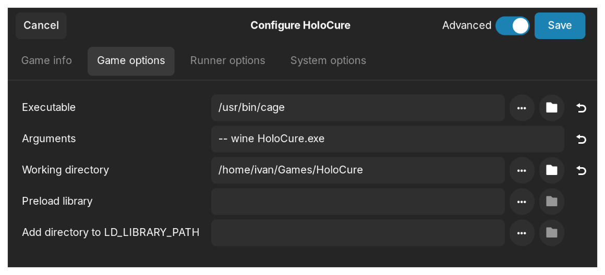
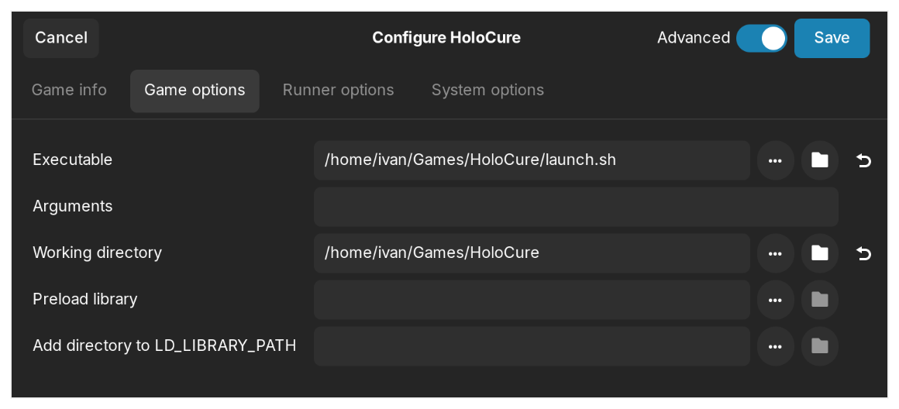
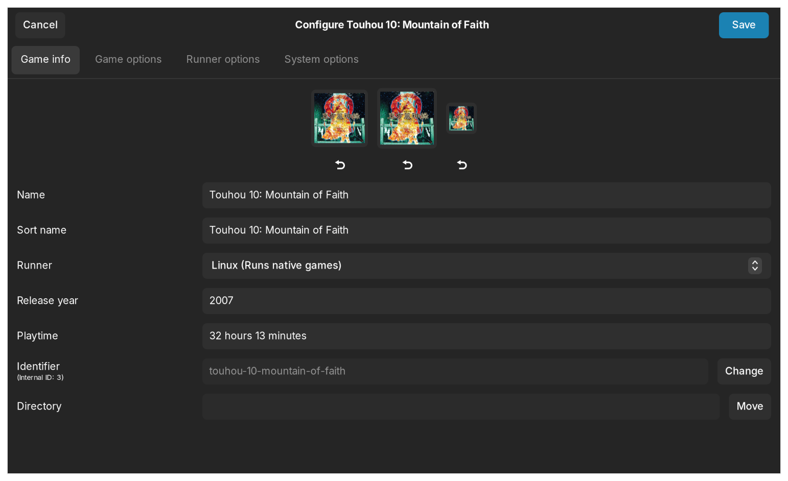
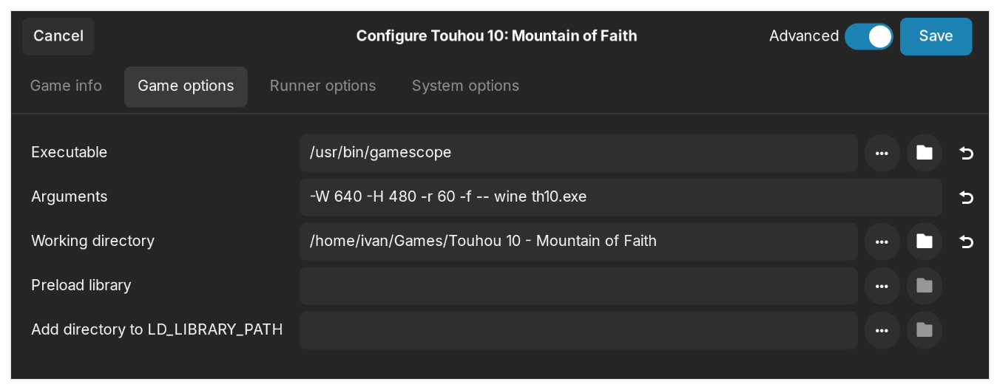
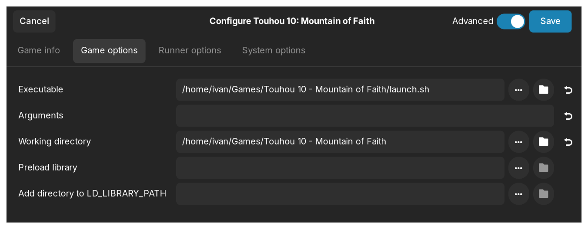

import { FileTree, Steps } from '@astrojs/starlight/components'
import ArchPkg from '../../../components/ArchPkg.astro'

Гайд по настройке Arch Linux для игр.

Особенности:

-   Для запуска исполняемых файлов Windows (`.exe`) используется [wine](http://winehq.org/)
-   В качестве лаунчера используется [Lutris](https://lutris.net/)
-   Для систем с [Wayland](https://wayland.freedesktop.org/) используются [Cage](https://www.hjdskes.nl/projects/cage/) и [gamescope](https://github.com/ValveSoftware/gamescope)

## 1. Включение репозитория `multilib`

Репозиторий `multilib` содержит 32-битное программное обеспечение и библиотеки,
которые можно использовать для запуска и сборки 32-битных приложений на
64-битных установках.

Чтобы включить `multilib`:

```shell
sudo -e /etc/pacman.conf
```

раскомментировать строки:

```ini
[multilib]
Include = /etc/pacman.d/mirrorlist
```

Далее необходимо синхронизировать репозиторий:

```shell
sudo pacman -Syu
```


## 2. Установка пакетов

Набор пакетов может показаться избыточным, но он обеспечивает корректную работу на разных системах.
Кроме того, некоторые пакеты могут быть уже установлены.

```shell
sudo pacman -S --needed lutris wine wine-gecko wine-mono winetricks giflib lib32-giflib libpng lib32-libpng libldap lib32-libldap gnutls lib32-gnutls openal lib32-openal v4l-utils lib32-v4l-utils libx11 lib32-libx11 ncurses lib32-ncurses libgcrypt lib32-libgcrypt libxcomposite lib32-libxcomposite dqlite lib32-sqlite libxinerama lib32-libxinerama gdk-pixbuf2 lib32-gdk-pixbuf2 gcc-libs lib32-gcc-libs ocl-icd lib32-ocl-icd libxslt lib32-libxslt libva lib32-libva gst-plugins-base lib32-gst-plugins-base libgpg-error lib32-libgpg-error libjpeg-turbo lib32-libjpeg-turbo libglvnd lib32-libglvnd libva-mesa-driver lib32-libva-mesa-driver vkd3d lib32-vkd3d lib32-vulkan-icd-loader vulkan-icd-loader glad psmisc fluidsynth libunwind vulkan-tools vulkan-headers
```

Для систем с PipeWire понадобятся пакеты
<ArchPkg pkg="lib32-libpipewire" repo="multilib" /> и
<ArchPkg pkg="lib32-pipewire" repo="multilib" /> &mdash; для работы звука:

```shell
sudo pacman -S lib32-libpipewire lib32-pipewire
```

Звук в некоторых играх не работает (по крайней мере у меня) и с этими библиотеками.
Проблему решает установка <ArchPkg pkg="lib32-libpulse" repo="multilib" />:

```shell
sudo pacman -S lib32-libpulse
```

Если используется видеокарта от AMD:

```shell
sudo pacman -S amdvlk lib32-amdvlk
```


## 3. Для систем с Wayland

При запуске игр с помощью wine используется XWayland, поэтому в некоторых
Wayland-композиторах потребуется использовать дополнительное ПО:

-   [Cage](https://www.hjdskes.nl/projects/cage/)
-   [gamescope](https://github.com/ValveSoftware/gamescope)
-   [xwayland-satellite](https://github.com/Supreeeme/xwayland-satellite)
-   [xwayland-run](https://gitlab.freedesktop.org/ofourdan/xwayland-run)

В этом гайде используются Cage и gamescope, так как на моей системе они
работают лучше всего.

### Cage

<Steps>

1.  Установите пакет <ArchPkg pkg="cage" />:

    ```shell
    sudo pacman -S cage
    ```

2.  Если игра ещё не добавлена, нажмите "+" в верхнем левом углу, выберите "Add locally installed game":

    

    **При настройке уже установленной игры этот шаг можно пропустить.**

3.  В настройках игры, разделе **Game Info** установить поле **Runner** в значение "Linux (Runs native games)"

    

4.  В разделе **Game Options** прописать параметры аналогичным образом, заменив путь до папки с игрой и название исполняемого файла

    

    В этом примере используется директория `/home/ivan/Games/HoloCure`:

    <FileTree>
        - Games
            - HoloCure
                - ...
                - **HoloCure.exe**
    </FileTree>

5.  В качестве альтернативы можно создать вспомогательный скрипт и указать его как исполняемый файл:

    <FileTree>
        - Games
            - HoloCure
                - ...
                - **launch.sh**
                - HoloCure.exe
    </FileTree>

    ```shell frame="none"
    #!/bin/sh

    cage -- wine HoloCure.exe
    ```

    

    :::caution

    Важно, чтобы у файла были права на исполнение:

    ```shell
    chmod +x /путь/до/скрипта/launch.sh
    ```

    :::

</Steps>

### gamescope

gamescope позволяет указать больше опций для композитора. Например, можно
указать разрешение. Это может быть полезно для игр с нестандартным размером
окна.

<Steps>

1.  Установите пакет <ArchPkg pkg="gamescope" />:

    ```shell
    sudo pacman -S gamescope
    ```

2.  Если игра ещё не добавлена, нажмите "+" в верхнем левом углу, выберите "Add locally installed game":

    

    **При настройке уже установленной игры этот шаг можно пропустить.**

3.  В настройках игры, разделе **Game Info** установить поле **Runner** в значение "Linux (Runs native games)".

    

4.  В разделе **Game Options** прописать параметры аналогичным образом, заменив путь до папки с игрой и название исполняемого файла

    

    В этом примере используется директория `/home/ivan/Games/Touhou 10 - Mountain of Faith`:

    <FileTree>
        - Games
            - `Touhou 10 - Mountain of Faith`
                - ...
                - **th10.exe**
    </FileTree>

5.  В качестве альтернативы можно создать вспомогательный скрипт и указать его как исполняемый файл:

    <FileTree>
        - Games
            - `Touhou 10 - Mountain of Faith`
                - ...
                - **launch.sh**
                - th10.exe
    </FileTree>

    ```shell frame="none"
    #!/bin/sh

    WINEPREFIX="$XDG_DATA_HOME/wineprefixes/default"
    LC_ALL="ja_JP.UTF-8"

    gamescope -W 640 -H 480 -r 60 -f -- wine th10.exe
    ```

    

    :::caution

    Важно, чтобы у файла были права на исполнение:

    ```shell
    chmod +x /путь/до/скрипта/launch.sh
    ```

    :::

</Steps>


## Перенос библиотеки игр из другой системы

Чтобы перенести библиотеку Lutris на новую систему, достаточно скопировать следующие директории:

-   `~/.cache/lutris`
-   `~/.config/lutris`
-   `~/.local/share/lutris`

Если использовалась системная версия `wine`, также потребуется скопировать
директорию `$WINEPREFIX` (по умолчанию `~/.wine`). Это нужно, чтобы перенести
сохранения игр, так как в этот каталог сохраняются данные приложений,
запускаемых через `wine`.

:::caution

Абсолютные пути файлов из библиотеки игр должны совпадать.

- Если игры хранились на отдельном разделе, в новой системе раздел с играми
  должен быть примонтирован по тому же пути, что и в предыдущей системе.

- Если игры хранились в `home/` (как правило, `~/Games`), то путь к директории
  должен быть таким же, как и в предыдущей системе.

:::
