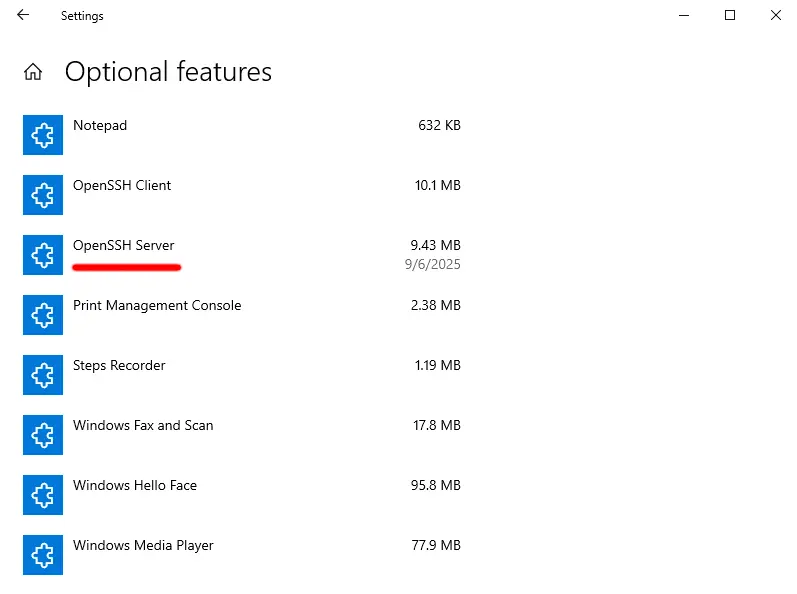

import { ArchPkg, Repology } from '@components/packaging'

## Установка

Требуется установить пакет <ArchPkg pkg="libvirt" /> и один из гипервизоров. Я
выбрал [QEMU](https://www.qemu.org/) (пакет <ArchPkg pkg="qemu-full" />). Для
добавление виртуальных машин требуется <ArchPkg pkg="virt-install" />.

```sh
sudo pacman -S libvirt virt-install qemu-full
```

<Repology pkg="libvirt" title="Статус сборки (libvirt)" />
<Repology pkg="qemu" title="Статус сборки (qemu)" />

Если виртуальные машины будут запускаться с графической сессией, можно
использовать <ArchPkg pkg="virt-viewer" />:

```sh
sudo pacman -S virt-viewer
```

<Repology pkg="virt-viewer" />

Включите и запустите службу `libvirtd`

```sh
sudo systemctl enable libvirtd
sudo systemctl enable libvirtd
```

Чтобы предоставить пользователю доступ к демону libvirt, проще всего добавить
его в группу `libvirt`:

```sh
sudo usermod -aG libvirt $(whoami)
```

## Создание ВМ

Скачайте ISO-образ операционной системы, которая будет использоваться в ВМ.
В таблице ниже перечислены ссылки на некоторые ОС.

|     ОС     |                             Ссылка                             |
| :--------: | :------------------------------------------------------------: |
| Arch Linux |                https://archlinux.org/download/                 |
| Linux Mint |               https://linuxmint.com/download.php               |
|   Ubuntu   |              https://ubuntu.com/download/desktop               |
| Windows 10 | https://www.microsoft.com/en-us/software-download/windows10ISO |

Для установки ВМ выполните команду ниже, указав необходимые параметры:

```sh /<.*>/
virt-install \
    --name <имя ВМ> \
    --memory <размер оперативной памяти> \
    --vcpus <количество виртуальных ядер> \
    --cpu host \
    --cdrom <путь до ISO-образа> \
    --disk size=<размер диска в ГБ>,format=qcow2 \
    --network user \
    --virt-type kvm \
    --graphics vnc
```

После чего необходимо установить операционную систему виртуальной машины в
открывшемся окне. Если окно не открылось, можно использовать `virt-viewer`
напрямую (здесь и далее `<имя ВМ>` совпадает с именем, указанным при
установке):

```sh
virt-viewer <имя ВМ>
```

## Использование ВМ

### Запуск

```sh
virsh start <имя ВМ>
virt-viewer <имя ВМ>
```

### Проигрывание аудио

Добавьте (или раскомментируйте) следующую опцию в файле
`/etc/libvirt/qemu.conf`:

```
vnc_allow_host_audio = 1
```

В качестве альтернативы можно использовать
[SPICE](https://wiki.archlinux.org/title/QEMU#SPICE).

### virtiofs

Необходимо отредактировать конфигурацию ВМ. Чтобы открыть конфигурацию для
редактирования, выполните команду:

```sh
virsh edit <имя ВМ>
```

Добавить параметры в соответствующих секциях конфигурации:

```diff lang="xml" /<путь на хосте>/
  <domain type='kvm'>
      [...]
  
+     <memoryBacking>
+       <source type='memfd'/>
+       <access mode='shared'/>
+     </memoryBacking>
  
      [...]
  
      <devices>
          [...]
  
+         <filesystem type='mount' accessmode='passthrough'>
+             <driver type='virtiofs'/>
+             <source dir='<путь на хосте>'/>
+             <target dir='host'/>
+         </filesystem>
  
          [...]
      </devices>
  
      [...]
  </devices>
```


Замените `<путь на хосте>` на путь до директории, которая будет доступна из
виртуальной машины.

Внутри ВМ примонтируйте директорию командой:

```sh
mount -t virtiofs host /mnt
```

См. также: [\[RedHat\] Sharing files between the host and its virtual machines by using virtiofs](https://docs.redhat.com/en/documentation/red_hat_enterprise_linux/9/html/configuring_and_managing_virtualization/sharing-files-between-the-host-and-its-virtual-machines_configuring-and-managing-virtualization#sharing-files-between-the-host-and-its-virtual-machines-using-virtio-fs_sharing-files-between-the-host-and-its-virtual-machines).

### Подключение по SSH. Port forwarding.

Самый простой способ настройки port forwarding &mdash; выполнить команду ниже,
когда ВМ запущена:

```sh /<.*?>/
virsh qemu-monitor-command --hmp <имя ВМ> 'hostfwd_add ::<порт на хосте>-:<порт на ВМ>'
```

Замените выделенные параметры на необходимые значения, например:

```sh
virsh qemu-monitor-command --hmp my-vm 'hostfwd_add ::2222-:22'
```

В примере выше 22 порт виртуальной машины "my-vm" будет доступен как 2222 порт
на хосте.

Эту команду необходимо выполнять после каждой остановки/запуска ВМ. Можно
автоматизировать этот процесс при помощи [хуков
libvirt](https://libvirt.org/hooks.html).

Убедитесь, что на виртуальной машине настроен и запущен sshd. Подключитесь к ВМ
командой:

```sh /<.*?>/
ssh <пользователь на ВМ>@127.0.0.1 -p <порт на хосте>
```

Для передачи файлов между ВМ и хостом можно использовать `scp` или настроить
SSHFS.

### Удаление

```sh
virsh destroy <имя ВМ>
virsh undefine <имя ВМ> --remove-all-storage
```

Если для указанной ВМ создавались снапшоты, их необходимо удалить:

```sh
virsh snapshot-delete <название снапшота>
```

## Настройка ВМ с Windows 10

### SSH

Включите возможность "OpenSSH Server".

В настройках перейдите в Settings > Apps > Apps & features > Optional features,
нажмите "Add a feature" и установите "OpenSSH Server".



В качестве альтернативы, выполните команду:

```powershell
Add-WindowsCapability -Online -Name OpenSSH.Server~~~~0.0.1.0
```

Возможно, после включения возможности потребуется перезагрузка.

Включите и запустите службу sshd:

```powershell
Start-Service sshd
Set-Service -Name sshd -StartupType 'Automatic'
```

Обычно, система автоматически создаст правило для фаерволла, позволяющее
подключаться по ssh, используя порт 22. Если правило не было создано (т.е.
подключение не удаётся) или требуется использовать другой порт, добавьте его
командой:

```powershell
New-NetFirewallRule -Name sshd -DisplayName 'OpenSSH Server (sshd)' -Enabled True -Direction Inbound -Protocol TCP -Action Allow -LocalPort 22 -Program "C:\Windows\System32\OpenSSH\sshd.exe"
```

По умолчанию, подключение по ssh будет запускать `cmd.exe`. Чтобы поменять
оболочку на PowerShell, выполните команду от имени администратора:

```powershell
New-ItemProperty -Path "HKLM:\SOFTWARE\OpenSSH" -Name DefaultShell -Value "C:\Windows\System32\WindowsPowerShell\v1.0\powershell.exe" -PropertyType String -Force
```

Скопируйте свой публичный SSH ключ в
`C:\Users\<имя пользователя>\.ssh\authorized_keys`.

[Настройте port forwarding](#подключение-по-ssh-port-forwarding) для ВМ и
подключитесь к ней командой:

```sh
ssh <пользователь на ВМ>@127.0.0.1 -p 2222
```

См. также: [\[Microsoft\] Key-based authentication in OpenSSH for Windows](https://learn.microsoft.com/en-us/windows-server/administration/openssh/openssh_keymanagement).
