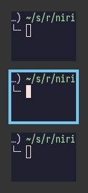
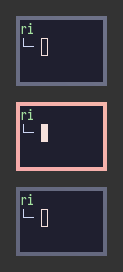
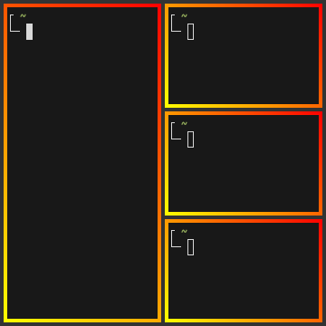
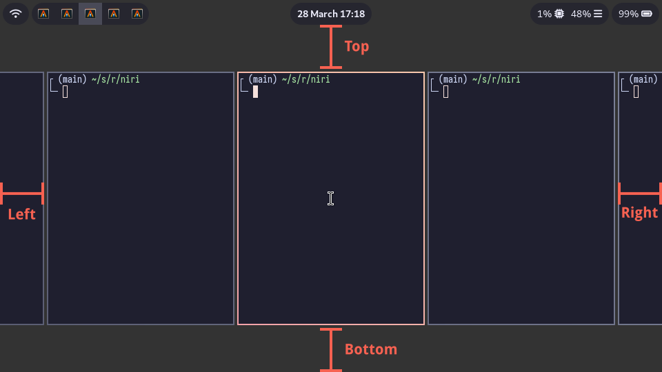

import { Badge } from '@astrojs/starlight/components'

В блоке `layout {}` вы можете настроить позиционирование и размер окон.

Полный пример конфигурации:

```kdl
layout {
    gaps 16
    center-focused-column "never"

    preset-column-widths {
        proportion 0.33333
        proportion 0.5
        proportion 0.66667
    }

    default-column-width { proportion 0.5; }

    focus-ring {
        // off
        width 4
        active-color "#7fc8ff"
        inactive-color "#505050"
        // active-gradient from="#80c8ff" to="#bbddff" angle=45
        // inactive-gradient from="#505050" to="#808080" angle=45 relative-to="workspace-view"
    }

    border {
        off
        width 4
        active-color "#ffc87f"
        inactive-color "#505050"
        // active-gradient from="#ffbb66" to="#ffc880" angle=45 relative-to="workspace-view"
        // inactive-gradient from="#505050" to="#808080" angle=45 relative-to="workspace-view" in="srgb-linear"
    }

    struts {
        // left 64
        // right 64
        // top 64
        // bottom 64
    }
}
```

## Опции

### `gaps`

Задаёт разрывы между окнами (внутри и снаружи) в логических пикселях.

<Badge text="С версии 0.1.7" variant="tip"/> Вы можете использовать дробные
значения. Оно будет округлено до физических пикселей согласно
[масштабированию](/niri/configuration/output#scale) каждого вывода.
Например, `gaps 0.5` на выводе с `scale 2` даст разрыв в 1px.

<Badge text="С версии 0.1.8" variant="tip"/> Вы можете достичь внутренних
зазоров без внешних (см. [`struts` ниже](#struts)).

### `center-focused-column`

Указывает, когда следует центрировать активную (сфокусированную) колонку.
Может быть одним из:

-   `"never"` &mdash; без особого центрирования, фокусировка на колонке вне
    видимого пространства экрана прокрутит пространство так, чтобы оно
    оказалось слева или справа внутри экрана. _По умолчанию_.
-   `"always"` &mdash; активная колонка всегда будет посередине.
-   `"on-overflow"` &mdash; фокусировка на колонке отцентрирует её, если она не
    помещается на экране вместе с ранее активной колонкой.

```kdl
layout {
    center-focused-column "always"
}
```

### `preset-column-widths`

Задаёт предустановленные ширины колонок, между которыми переключается действие
`switch-preset-column-width` (комбинация клавиш <kbd>Mod</kbd><kbd>R</kbd>).

`proportion` задаёт ширину в дробном значении от ширины вывода, беря в расчёт
[разрывы](#gaps). Например, вы можете идеально уместить 4 окна шириной
`proportion 0.25` внутри вывода, вне зависимости от установленных разрывов.
По умолчанию, предустановлены ширины <sup>1</sup>/<sub>3</sub>,
<sup>1</sup>/<sub>2</sub> и <sup>2</sup>/<sub>3</sub>.

`fixed` задаёт абсолютную ширину в логических пикселях.

```kdl
layout {
    // Циклически менять значения между 1/3, 1/2, 2/3 и 1280px.
    preset-column-widths {
        proportion 0.33333
        proportion 0.5
        proportion 0.66667
        fixed 1280
    }
}
```

:::note

В настоящее время, предустановленная фиксированная ширина не учитывает границы.
Т.е. при предустановке фиксированной ширины 1000 с границами шириной 4, окно
будет иметь ширину 992 логических пикселя. Возможно, со временем это будет
исправлено.

Все остальные способы использования фиксированной ширины (например,
`default-column-width` или `set-column-width` действительно учитывают границы
и дают вам точную ширину окна, которую вы запрашиваете.

:::

### `default-column-width`

Задаёт ширину новых окон по умолчанию.

Синтаксис полностью совпадает с [`preset-column-widths`](#preset-column-widths).

```
layout {
    // Новые окна будут иметь размер 1/3 от ширины экрана.
    default-column-width { proportion 0.33333; }
}
```

Вы также можете оставить фигурные скобки `{}` пустыми, в этом случае приложение
само выберет нужную ширину.

:::note

`default-column-width {}` заставляет niri отправить размер `(0, H)` в начальном
запросе конфигурации.

Это немного [неточно определено](https://gitlab.freedesktop.org/wayland/wayland-protocols/-/issues/155)
в протоколе Wayland, поэтому некоторые клиенты могут неправильно его
интерпретировать. На практике единственным проблемным клиентом, который я
видел, является [foot](https://codeberg.org/dnkl/foot/), который воспринимает
это как запрос на буквальную нулевую ширину.

В любом случае, `default-column-width {}` наиболее полезен для конкретных окон,
в виде [правила окна](/niri/configuration/window-rules) с тем же синтаксисом.

:::

:::tip[От переводчика]

Также `default-column-width {}`, напротив, требуется некоторым клиентам,
например [WezTerm](https://github.com/wez/wezterm) (см. раздел
[Проблемы с приложениями](/niri/usage/application-issues#wezterm))

:::

### `focus-ring` и `border`

Кольцо фокуса и границы отображаются вокруг окон и подсказывают, какое окно активно.
Они очень похожи и их опции совпадают.

Единственное отличие состоит в том, что кольцо фокуса отображается только
вокруг активного окна, когда как границы отрисовываются вокруг всех окон и
влияют на их размер (окна уменьшаются, чтобы оставить место для границ).

|                  Кольцо фокуса                   |                Граница                 |
| :----------------------------------------------: | :------------------------------------: |
|  |  |

:::tip

По умолчанию, и кольца фокуса, и границы отрисовываются как прямоугольники позади окон. Таким образом, они также будут видны сквозь полупрозрачные окна. Всё потому, что окна с декорациями на стороне клиента могут быть произвольной формы.

Если вам это не нравится, вам нужно раскомментировать опцию `prefer-no-csd` на
[верхнем уровне конфигурации](/niri/configuration/misc). Niri отобразит границы
и кольца фокуса _вокруг_ тех окон, которые согласны проигнорировать декорации
на стороне клиента.

И наоборот, вы можете переопределить это поведение с помощью
[правила](/niri/configuration/window-rules) `draw-border-with-background`.

:::

Кольцо фокуса и граница имеют следующие опции:

```kdl
layout {
    // Кольцо фокуса (focus-ring) имеет те же опции.
    border {
        // Раскомментируйте линию ниже, чтобы отключить границы.
        // off

        // Ширина границ в логических пикселях.
        width 4

        active-color "#ffc87f"
        inactive-color "#505050"

        // active-gradient from="#ffbb66" to="#ffc880" angle=45 relative-to="workspace-view"
        // inactive-gradient from="#505050" to="#808080" angle=45 relative-to="workspace-view" in="srgb-linear"
    }
}
```

#### Ширина <Badge text="width" variant="note"/>

Устанавливает ширину границ в логических пикселях.

<Badge text="С версии 0.1.7" variant="tip" /> Вы можете использовать дробные
значения. Оно будет округлено до физических пикселей согласно
[масштабированию](/niri/configuration/output#scale) каждого вывода.
Например, `width 0.5` на выводе с `scale 2` даст границу шириной в 1px.

```kdl
layout {
    border {
        width 2
    }
}
```

### Цвета
<Badge text="active-color" variant="note"/>
<Badge text="inactive-color" variant="note"/>

Цвета можно задавать разными способами:

-   Названия цветов CSS: `"red"`
-   RGB hex (шестнадцатеричное число): `"#rgb"`, `"#rgba"`, `"#rrggbb"`, `"#rrggbbaa"`
-   CSS-подобные нотации: `"rgb(255, 127, 0)"`, `"rgba()"`, `"hsl()"` и т.п.

Опция `active-color` &mdash; это цвет кольца фокуса / границы вокруг активного окна,
а `inactive-color` &mdash; цвет вокруг неактивного окна.

Так как кольцо фокуса (`focus-ring`) отрисовывается только вокруг активного окна,
вы никогда не увидете их при использовании одного монитора, однако сможете увидеть,
если используете несколько.

Также есть _устаревший_ синтаксис, задающий цвета с помощью четырёх чисел
(R, G, B и A): `active-color 127 200 255 255`.

### Градиенты
<Badge text="active-gradient" variant="note"/>
<Badge text="inactive-gradient" variant="note"/>

Аналогично цветам, вы можете задавать свойства `active-gradient` и
`inactive-gradient`, которые имеют больший приоритет.

Градиенты отображаются так же, как в CSS: 
[`linear-gradient(угол, от, до)`](https://developer.mozilla.org/ru-RU/docs/Web/CSS/gradient/linear-gradient).
Угол работает точно также, как в `linear-gradient`, является опциональным и
равен `180` (сверху-вниз) по умолчанию. Вы можете использовать для настройки
любую веб-утилиту, [как эта](https://www.css-gradient.com/).

```kdl
layout {
    focus-ring {
        active-gradient from="#80c8ff" to="#bbddff" angle=45
    }
}
```

Градиенты могут раскрашиваться как отдельно для окон (по умолчанию), так и для
всего рабочего пространства. Чтобы задать это, используйте опцию
`relative-to="workspace-view"`. Вот пример:

|                       По умолчанию                     |                С опцией `relative-to="workspace-view"`                |
| :----------------------------------------------------: | :-------------------------------------------------------------------: |
|  |  |

```kdl "relative-to=\"workspace-view\""
layout {
    border {
        active-gradient from="#ffbb66" to="#ffc880" angle=45 relative-to="workspace-view"
        inactive-gradient from="#505050" to="#808080" angle=45 relative-to="workspace-view"
    }
}
```

<Badge text="С версии 0.1.8" variant="tip"/> Вы можете задать цветовое
пространство градиентной интерполяции, используя синтаксис `in="srgb-linear"`
или `in="oklch longer hue"`. Поддерживаются следующие цветовые пространства:

-   `srgb` (по умолчанию)
-   `srgb-linear`
-   `oklab`
-   `oklch` с `shorter hue`, или `longer hue`, или `increasing hue`, или `decreasing hue`

Они отображаются также, как в CSS. Например, `active-gradient from="#f00f"
to="#0f05" angle=45 in="oklch longer hue"` будет выглядеть также, как
`linear-gradient(45deg in oklch longer hue, #f00f, #0f05)` в CSS.


```kdl "in=\"oklch longer hue\""
layout {
    border {
        active-gradient from="#f00f" to="#0f05" angle=45 in="oklch longer hue"
    }
}
```

### `struts`

Отступы (`struts`) уменьшают пространство, занимаемое окнами, подобно панелям
layer-shell.
Вы можете рассмотривать их как внешние разрывы (см. [`gaps`](#gaps)).
Задаются в логических пикселях.

Отступы слева и справа приведут к тому, что следующее сбоку окно всегда будет
немного выглядывать. Отступы сверху и снизу просто добавят внешние зазоры в
дополнение к площади, занимаемой панелями-слоями и разрывами.

<Badge text="С версии 0.1.7" variant="tip"/> Вы можете использовать дробные
значения. Оно будет округлено до физических пикселей согласно
[масштабированию](/niri/configuration/output#scale) каждого вывода.
Например, `top 0.5` на выводе с `scale 2` даст отступ сверху шириной в 1px.

```kdl
layout {
    struts {
        left 64
        right 64
        top 64
        bottom 64
    }
}
```



<Badge text="С версии 0.1.8" variant="tip"/> Вы можете использовать
отрицательные значения. Они вытолкнут окна за пределы экрана.

Вы можете использовать отрицательные отступы с равными по модулю разрывами,
чтобы достичь внутренних разрывов без внешних. Например, следующим образом:

```kdl
layout {
    gaps 16

    struts {
        left -16
        right -16
        top -16
        bottom -16
    }
}
```
