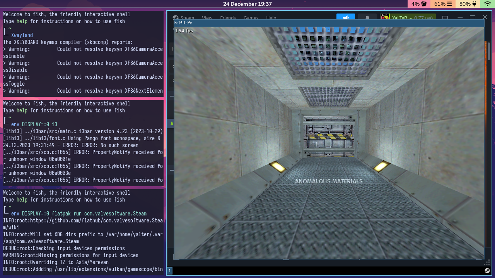

import { Steps } from '@astrojs/starlight/components'

X11 слишком запутанный, поэтому на данный момент встроенная поддержка `Xwayland` не планируется.
Тем не менее, есть несколько способов запустить X11-приложения в niri.

## Используя xwayland-satellite

[`xwayland-satellite`](https://github.com/Supreeeme/xwayland-satellite) &mdash;
это новый проект, который, по сути, реализует безкорневой Xwayland в отдельном приложении,
без вовлечения композитора. Хотя он ещё в какой-то степени эксперементальный, множество
приложений работают корректно; например, Steam и игры, Discord.

Соберите бинарный файл, как описанно в инструкции, описанной в его README-файле,
затем запустите `xwayland-satellite`. Теперь вы можете запустить приложение на
дисплее X11, который он предоставляет:

```shell
env DISPLAY=:0 flatpak run com.valvesoftware.Steam
```

Они отобразятся как обычные окна.

## Запуск Xwayland напрямую в корневом режиме

Этот метод предполагает прямой вызов XWayland и запуск его как собственного
окна, а также требует наличия дополнительного оконного менеджера X11,
запущенного внутри него.



Вот как это сделать:

<Steps>

1.  Запустите `Xwayland` (просто бинарный файл без дополнительных флагов).
    Появится чёрное окно.
    Для удобства, вы можете изменить его размер (<kbd>Ctrl</kbd><kbd>R</kbd>)
    и сделать полноэкранным (<kbd>Ctrl</kbd><kbd>Shift</kbd><kbd>F</kbd>).
    На более ранних версиях `Xwayland` это окно будет полноэкранным, а его размер
    нельзя будет изменить.

2.  Запустите какой-нибудь оконный менеджер внутри него, например:

    ```shell
    env DISPLAY=:0 i3
    ```

    Так вы сможете управлять окнами в экземпляре `Xwayland`.

3.  Запустите какое-либо X11-приложение, например:

    ```shell
    env DISPLAY=:0 flatpak run com.valvesoftware.Steam
    ```

</Steps>

С полноэкранным окном внутри полноэкранного `Xwayland`,
вы получите вполне нормальный игровой опыт.

:::tip

Если вы не запустите оконный менеджер X11, Xwayland будет закрывать и открывать
свое окно каждый раз, когда все окна X11 закрываются и открываются новые. Чтобы
предотвратить это, запустите оконный менеджер X11 внутри, 
как было сказано выше, или откройте какое-нибудь другое окно X11,
работающее долгое время.

:::

Единственный недостаток заключается в том, что текущий корневой экземпляр
`Xwayland`, по-видимому, не разделяет один буфер обмена с композитором.
С текстовыми данными вы можете достичь этого вручную, используя
[`wl-clipboard`](https://github.com/bugaevc/wl-clipboard):

```shell
env DISPLAY=:0 xsel -ob | wl-copy       # Скопировать текст из Xwayland в niri
wl-paste -n | env DISPLAY=:0 xsel -ib   # Вставить текст из niri в буфер обмена Xwayland
```

При желании их можно привязать к горячим клавишам:

```kdl
binds {
    Mod+Shift+C { spawn "sh" "-c" "env DISPLAY=:0 xsel -ob | wl-copy"; }
    Mod+Shift+V { spawn "sh" "-c" "wl-paste -n | env DISPLAY=:0 xsel -ib"; }
}
```

## Используя `xwayland-run` для запуска Xwayland

[`xwayland-run`](https://gitlab.freedesktop.org/ofourdan/xwayland-run) &mdash;
это вспомогательная утилита для запуска X11-клиентов внутри отдельного корневого
Xwayland-сервера. Она запускает Xwayland, устанавливает переменную окружения
`DISPLAY` для X11, настраивает `xauth` и запускает указанный клиент внутри только
что запущенного экземпляря Xwayland. При завершении процесса клиента `xwayland-run`
автоматически завершит выделенный сервер Xwayland.

Работает это следующим образом:

```shell
xwayland-run <аргументы Xwayland> -- ваше-x11-приложения <его аргументы>
```

Например:

```shell
xwayland-run -geometry 640x480 -fullscreen -- wine th08.exe
```

## Используя Wayland-композитор Cage

Помимо способов, описанных выше, вы также можете запускать приложения X11,
используя [Cage](https://github.com/cage-kiosk/cage), который работает во
встроенной Wayland-сессии, которая также поддерживает Xwayland, где можно
запустить сами X11-приложения.

В отличие от метода с корневым Xwayland-сервером, этот не требует запуска
отдельного оконного менеджера и может быть использован одной командой:

```shell
cage -- /путь/до/приложения
```

Однако, это также может привести к проблемам, когда несколько приложений
запущены в Cage, так как Cage предназначен для работы в киосках, т.е.
каждое новое окно будет автоматически развернуто во весь экран и займет
место ранее открытого окна.

Чтобы использовать Cage:

<Steps>

1.  Установите пакет `cage`, который должен быть доступен в большинстве
    репозиториев.

2.  Запустите:

    ```shell
    cage -- /путь/до/приложения
    ```

</Steps>

Вы также можете изменить desktop-элемент приложения, добавив приставку `cage -- `
к свойству `Exec`. Например, так бы выглядел изменённый элемент Spotify Flatpak:


```desktop
[Desktop Entry]
Type=Application
Name=Spotify
GenericName=Online music streaming service
Comment=Access all of your favorite music
Icon=com.spotify.Client
Exec=cage -- flatpak run com.spotify.Client
Terminal=false
```

## Используя gamescope

Вы можете использовать [gamescope](https://github.com/ValveSoftware/gamescope),
чтобы запускать приложения X11 и даже Steam напрямую.

Подобно Cage, gamescope показывает только одно, последнее окно, поэтому он не
предназначен для запуска обычных приложений. Однако вы можете запустить Steam
в gamescope, а затем какую-нибудь игру:

```shell
gamescope -- flatpak run com.valvesoftware.Steam
```

Чтобы запустить gamescope в полноэкранном режиме, вы можете указать нужное
разрешение и добавить флаг для запуска в полноэкранном режиме:

```shell
gamescope -W 2560 -H 1440 -w 2560 -h 1440 -f  -- flatpak run com.valvesoftware.Steam
```

:::note

Если Steam аварийно завершает работу во время запуска в gamescope, похоже. что
последующие вызовы gamescope иногда не могут запустить его должным образом.
Если это произошло, запустите Steam внутри корневого Xwayland, как описано выше,
затем выйдите из него, и тогда вы снова сможете использовать gamescope.

:::
